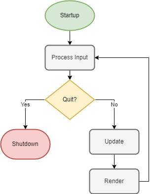

<a name="top"></a>

<!-- PROJECT SHIELDS -->
<!--
URLs are written in "reference style" for readability.
Reference style uses brackets [ ] instead of parentheses ( ).
See the bottom of this document for the reference declarations.
https://www.markdownguide.org/basic-syntax/#reference-style-links
-->

<div align="center">

<!-- [![Contributors][contributors-shield]][contributors-url] -->
<!-- [![Forks][forks-shield]][forks-url] -->
<!-- [![Stargazers][stars-shield]][stars-url] -->

[![Issues][issues-shield]][issues-url] [![AFL License][license-shield]][license-url]


# PyCG Framework

A framework for rendering 3D computer graphics with Python.

<!-- [Explore the docs](https://github.com/rsonger/pycg-framework) » -->

[Try It](#usage) · [Report Bug][issues-url] · [Request Feature][issues-url]

![Screenshot][screenshot]

</div>


<!-- TABLE OF CONTENTS -->
<!-- <details>
  <summary>Table of Contents</summary> -->
## Table of Contents
  1. [About the Project](#about-the-project)
     - [Built With](#built-with)
  2. [Getting Started](#getting-started)
     - [Prerequisites](#prerequisites)
     - [Installation](#installation)
  3. [Usage](#usage)
  4. [License](#license)
  5. [Contact](#contact)
  6. [References](#references)

</details>


<!-- ABOUT THE PROJECT -->
## About The Project

This 3D CG graphics framework was created using Python for the purposes of teaching Computer Graphics and Software Engineering through the object-oriented design and application of a CG rendering library. The framework is largely inspired by the one developed by Lee Stemkoski and Michael Pascale (see [References](#references)) with a focus on cross-compatibility, object-oriented software design principles, and the use of pythonic conventions over the ones commonly used with OpenGL.

For more information on the course and the companion material that uses this framework, see the [Software Engineering Lab][selab-url] website and the posts there.

<div align="right">

( [back to top](#top) )

</div>


### Built With

* [![Python][Python]][Python-url]
* [![Pygame][Pygame]][Pygame-url]
* [![PyOpenGL][PyOpenGL]][PyOpenGL-url]

<div align="right">

( [back to top](#top) )

</div>


<!-- GETTING STARTED -->
## Getting Started

The following instructions describe how to create a local copy of the framework and configure it to run in a virtual environment.

### Prerequisites

This project requires **Python 3.8+** and it is recommended to use a virtual environment for installing all the dependencies. Either **venv** or **Pipenv** work fine.
* [Python][Python-url]
* [venv][venv-url]
* [Pipenv][pipenv-url]

### Installation

1. Clone the repo.  
   ```sh
   git clone https://github.com/rsonger/pycg-framework.git
   ```
2. Create a virtual environment.  
  **venv**
   ```sh
   python -m venv .venv
   ```
   **Pipenv**
   ```sh
   pipenv install
   ```
3. Activate the virtual environment.  
   **venv**
   ```sh
   # Windows
   source .venv/Scripts/activate
   # MacOS
   source .venv/bin/activate
   ```
   **Pipenv**
   ```sh
   pipenv shell
   ```
4. In **venv**, the packages need to be installed after activating the environment.  
   ```sh
   pip install -r requirements.txt
   ```
5. On **MacOS**, a discrepency in the OpenGL package may result in an `ImportError`. You can test this by running the following command in the terminal:  
   ```sh
   python -c "import OpenGL.GL"
   ```
   If you see the error, look at the Traceback and find the location of the `site-packages\OpenGL\platform` directory inside your Python library. Open the `ctypesloader.py` file from that directory and find the line that has:
   ```python
   fullName = util.find_library( name )
   ```
   Then change the line to:  
   ```python
   fullName = f"/System/Library/Frameworks/{name}.framework/{name}"
   ```

<div align="right">

( [back to top](#top) )

</div>


<!-- USAGE EXAMPLES -->
## Usage

The `WindowApp` class in the `graphics.core.app` module contains all the basic logic for setting up a rendering context inside a windowed application. It implements the typical lifecycle of an interactive rendering application as shown in the flowchart below. An application using the framework should extend the `WindowApp` class and implement its `startup` and `update` methods as exemplified by the program in `demo.py`.

<div align="center">



</div>

Run the demo app with `python demo.py` to see the scene depicted in the screenshot from above. The demo also makes use of `CameraRig` from `graphics.extras.camera_rig` which allows the user to move through the scene and look. The keys <kbd>W</kbd><kbd>A</kbd><kbd>S</kbd><kbd>D</kbd> move the camera forward, left, back, and right while <kbd>Q</kbd> and <kbd>E</kbd> move it down and up. The keys <kbd>I</kbd><kbd>J</kbd><kbd>K</kbd><kbd>L</kbd> rotate the camera to look up, left, down, and right. 

<!-- *For more examples, please refer to the [Documentation](https://example.com)* -->

<div align="right">

( [back to top](#top) )

</div>


<!-- ROADMAP -->
## Roadmap

- [x] [Window context](https://robsonger.dev/software-engineering-lab/notes/windows-points/)
  - [x] [Input handler](https://robsonger.dev/software-engineering-lab/notes/windows-points/#the-input-class)
  - [x] [Keyboard inputs](https://robsonger.dev/software-engineering-lab/notes/animations/#keyboard-input-with-pygame)
- [x] OpenGL interfaces
  - [x] [GPU program compiler](https://robsonger.dev/software-engineering-lab/notes/windows-points/#22---drawing-a-point)
  - [x] [VAOs (vertex array objects)](https://robsonger.dev/software-engineering-lab/notes/drawing-shapes/)
  - [x] [Uniform variables](https://robsonger.dev/software-engineering-lab/notes/animations/#the-uniform-class)
- [x] [Time-keeping for animations](https://robsonger.dev/software-engineering-lab/notes/animations/#keeping-time)
- [x] [Matrices for geometric transformations](https://robsonger.dev/software-engineering-lab/notes/the_matrix/)
- [x] [Scene graph](https://robsonger.dev/software-engineering-lab/notes/scene_graph/)
  - [x] [3D Objects](https://robsonger.dev/software-engineering-lab/notes/scene_graph/#3d-objects)
  - [x] [Vertex geometry](https://robsonger.dev/software-engineering-lab/notes/geometry_and_material/#geometry-objects)
    - [x] [Parametric Geometries](https://robsonger.dev/software-engineering-lab/notes/parametric_geometry/)
  - [x] [Shader materials](https://robsonger.dev/software-engineering-lab/notes/geometry_and_material/#material-objects)
  - [x] [Camera object](https://robsonger.dev/software-engineering-lab/notes/scene_graph/#camera)
  - [x] [Renderer](https://robsonger.dev/software-engineering-lab/notes/geometry_and_material/#rendering-scenes-with-the-framework)
  - [x] Extra components
    - [x] [Axes helper](https://robsonger.dev/software-engineering-lab/notes/building_a_scene/#axes-helper)
    - [x] [Grid helper](https://robsonger.dev/software-engineering-lab/notes/building_a_scene/#grid-helper)
    - [x] [Camera rig](https://robsonger.dev/software-engineering-lab/notes/building_a_scene/#camera-rig)
- [ ] Texture Mapping
  - [x] Basic texture shader
  - [ ] Procedurally generated textures
  - [ ] Generating textures from text
  - [ ] 2D Sprites
- [ ] Heads-Up Display
  - [ ] Orthogonal projection
- [ ] TV textures as render targets
- [ ] Postprocessing
- [ ] Lighting
  - [ ] Ambient, directional, and point sources
  - [ ] Normal vectors for vertices
  - [ ] Shader attributes and uniforms
  - [ ] Rendering lights
  - [ ] Light source helpers
  - [ ] Bump mapping
  - [ ] Bloom and glow effects
  - [ ] Shadows

<div align="right">

( [back to top](#top) )

</div>


<!-- CONTRIBUTING -->
<!-- ## Contributing

Contributions are what make the open source community such an amazing place to learn, inspire, and create. Any contributions you make are **greatly appreciated**.

If you have a suggestion that would make this better, please fork the repo and create a pull request. You can also simply open an issue with the tag "enhancement".
Don't forget to give the project a star! Thanks again!

1. Fork the Project
2. Create your Feature Branch (`git checkout -b feature/AmazingFeature`)
3. Commit your Changes (`git commit -m 'Add some AmazingFeature'`)
4. Push to the Branch (`git push origin feature/AmazingFeature`)
5. Open a Pull Request

<div align="right">

( [back to top](#top) )

</div> -->


<!-- LICENSE -->
## License

Distributed under the [Academic Free License][afl-url]. See `LICENSE.txt` for more information.

<div align="right">

( [back to top](#top) )

</div>


<!-- CONTACT -->
## Contact

Rob Songer

[![Website][website-shield]][website-url]

Project Link: https://github.com/rsonger/pycg-framework

<div align="right">

( [back to top](#top) )

</div>


<!-- REFERENCES -->
## References

* Lee Stemkoski and Michael Pascale (2021). *Developing Graphics Frameworks with Python and OpenGL*. CRC Press, [in print][textbook-print-url] and [online][textbook-online-url]. DOI: [10.1201/9781003181378][textbook-doi]

<div align="right">

( [back to top](#top) )

</div>


<!-- MARKDOWN LINKS & IMAGES -->
<!-- https://www.markdownguide.org/basic-syntax/#reference-style-links -->
<!-- [contributors-shield]: https://img.shields.io/github/contributors/rsonger/pycg-framework.svg?style=flat-square -->
<!-- [contributors-url]: https://github.com/rsonger/pycg-framework/graphs/contributors -->
<!-- [forks-shield]: https://img.shields.io/github/forks/rsonger/pycg-framework.svg?style=flat-square -->
<!-- [forks-url]: https://github.com/rsonger/pycg-framework/network/members -->
<!-- [stars-shield]: https://img.shields.io/github/stars/rsonger/pycg-framework.svg?style=flat-square -->
<!-- [stars-url]: https://github.com/rsonger/pycg-framework/stargazers -->
[issues-shield]: https://img.shields.io/github/issues/rsonger/pycg-framework.svg?style=flat-square
[issues-url]: https://github.com/rsonger/pycg-framework/issues
[license-shield]: https://img.shields.io/github/license/rsonger/pycg-framework.svg?style=flat-square
[license-url]: https://github.com/rsonger/pycg-framework/blob/master/LICENSE.txt
[website-shield]: https://img.shields.io/website?style=flat-square&url=https%3A%2F%2Frobsonger.dev%2F
[website-url]: https://robsonger.dev/
[screenshot]: images/screenshot.png
[selab-url]: https://robsonger.dev/software-engineering-lab/
[Python]: https://img.shields.io/github/pipenv/locked/python-version/rsonger/pycg-framework?style=flat-square
[Python-url]: https://www.python.org/
[Pygame]: https://img.shields.io/badge/Pygame-2.1.1-brightgreen?style=flat-square
[Pygame-url]: https://pygame.org/
[PyOpenGL]: https://img.shields.io/badge/PyOpenGL-3.1.6-lightgrey?style=flat-square
[PyOpenGL-url]: http://pyopengl.sourceforge.net/
[venv-url]: https://docs.python.org/3/library/venv.html
[pipenv-url]: https://pipenv.pypa.io/
[afl-url]: https://opensource.org/licenses/AFL-3.0
[textbook-print-url]: https://www.routledge.com/Developing-Graphics-Frameworks-with-Python-and-OpenGL/Stemkoski-Pascale/p/book/9780367721800
[textbook-online-url]: (https://www.taylorfrancis.com/books/oa-mono/10.1201/9781003181378/developing-graphics-frameworks-python-opengl-lee-stemkoski-michael-pascale)
[textbook-doi]: https://doi.org/10.1201/9781003181378
